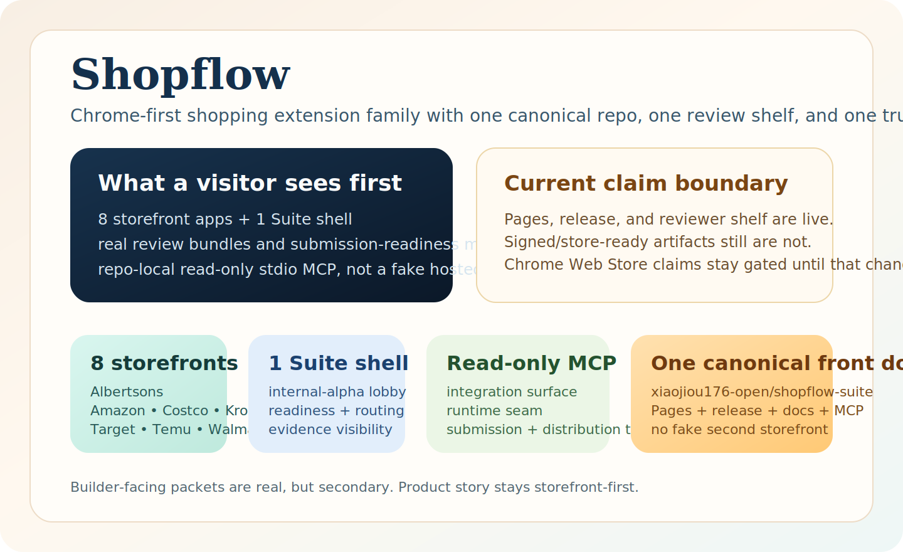
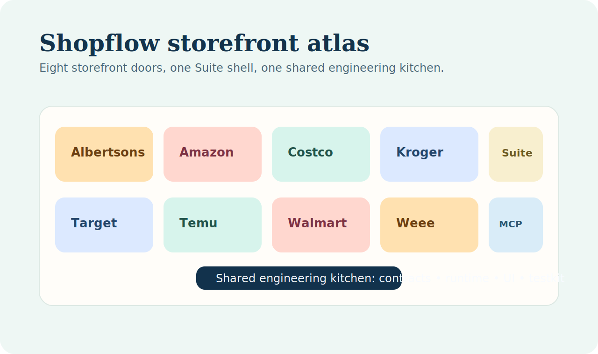
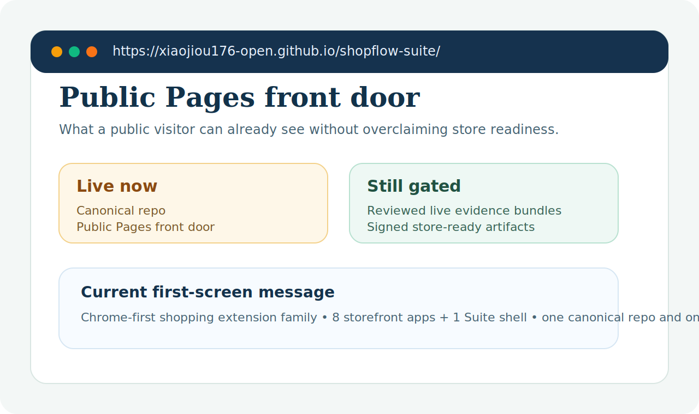
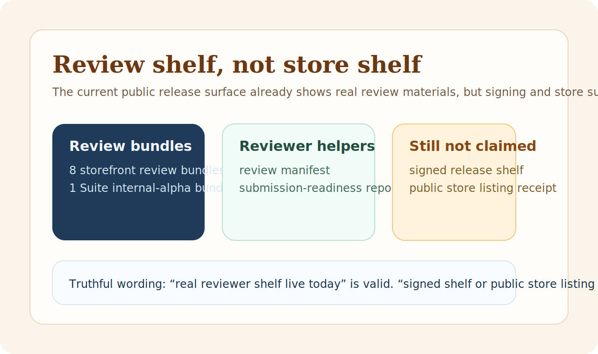

# Shopflow Docs Front Door

This page is the quickest honest map for readers who need to understand what
Shopflow is, what exists today, and what still should not be overclaimed.

[Public repo README](../README.md) ·
[Distribution truth](../DISTRIBUTION.md) ·
[Latest release](https://github.com/xiaojiou176-open/shopflow-suite/releases/latest)

## Shopflow in Three Lines

- **Category:** a Chrome-first shopping extension family with `8` store apps and `1` suite shell
- **Heat hook:** multiple storefront entry points can stay discoverable without splitting the engineering source of truth
- **Current result:** repo-owned contracts, runtime surfaces, and review packaging exist today, but public-ready support claims still require stronger evidence

## Verification Layers

Use the verification stack like five different desks in the same office:

- `pre-commit`
  - `pnpm verify:local-hygiene`
  - fast local hygiene only
- `pre-push`
  - `pnpm verify:pre-push`
  - stronger local confidence without forcing E2E + packaging on every push
- `hosted`
  - `shopflow-ci` runs `pnpm verify:release-readiness`
  - strongest repo-owned serial release-readiness answer
- `nightly`
  - `external-governance` runs `pnpm verify:external-governance`
  - public-surface drift and GitHub platform capability checks
- `manual`
  - live/browser/review/signing/submission lanes
  - use these only when real browser state, real review input, or external systems are involved

Important boundary:

> `verify:release-readiness` is the strongest repo-owned lane.
> It is still not the same thing as reviewed live evidence, signing, or real store submission.

## Public Repo Topology

Keep the public-repo map simple:

- `shopflow-suite` = the only canonical Shopflow repo and default front door
- OpenClaw installs now use
  `github:xiaojiou176-open/shopflow-suite?dir=distribution/openclaw-plugin`
- the repo now also ships a read-only stdio MCP entry for AI tools

In plain language:

> one main building, one canonical install counter, and one repo-local MCP desk.

## Primary Product vs Companion Surfaces

Use this like a floor map:

| Surface | Role | What it proves | What it must not be mistaken for |
| :--- | :--- | :--- | :--- |
| `apps/ext-*` + `apps/ext-shopping-suite` | primary product lane | Shopflow is a browser-first extension family | a packet mirror or MCP-first product |
| `distribution/openclaw-plugin/skills/shopflow-read-only-packet/` | companion skill packet | host-native packet consumers can install one truthful folder | proof that Chrome Web Store or broader Shopflow browser lanes are already live |
| `distribution/public-packets/` | companion mirror rack | target-specific fallback packets still exist in-repo | a second canonical public front door |
| `pnpm mcp:stdio` + ecosystem docs | companion repo-truth lane | AI tools can inspect read-only runtime and submission-readiness truth | a public HTTP MCP or public SDK package |

## Public Surfaces In One Glance

## Search-Intent Redirects

If you arrived here from a search box instead of repo history, use this like a
bookstore clerk pointing you to the right shelf:

If you are opening the public repo for the first time and are **not**
specifically searching for a Codex / Claude Code / OpenClaw packet, skip this
table and start with:

- [ADR-001: Shopflow Repo Topology and Product Boundary](./adr/ADR-001-shopflow-repo-topology-and-product-boundary.md)
- [Testing and Verification Bar](./contracts/testing-and-verification-bar.md)
- [Evidence and Submission Current-Scope Readiness](./ecosystem/evidence-submission-current-scope-readiness.md)

In plain language:

> the default story of this repo is still "shopping extension family with
> strict claim boundaries." The ecosystem packet pages are secondary routes,
> not the main product identity.

| If you searched for... | Open this page first | Run this command first | Reuse this boundary sentence |
| :--- | :--- | :--- | :--- |
| `Shopflow Codex plugin` | [Codex Quickstart](./ecosystem/codex-quickstart.md) | `pnpm cli:read-only -- agent-target-packet --target codex` | Shopflow now ships a Codex-specific public-distribution bundle and metadata packet; only call it an official Codex listing where an official Codex surface actually exists. |
| `Shopflow Claude Code skills` | [Claude Code Quickstart](./ecosystem/claude-code-quickstart.md) | `pnpm cli:read-only -- agent-target-packet --target claude-code` | Shopflow now ships a Claude Code-specific public-distribution bundle and skills-facing packet; only call it an official Claude Code listing where an official surface actually exists. |
| `Shopflow OpenCode packet` | [Agent Quickstarts](./ecosystem/agent-quickstarts.md) | `pnpm cli:read-only -- agent-target-packet --target opencode` | OpenCode stays ecosystem-secondary here; the repo only ships a target-specific handoff packet, not an official OpenCode package. |
| `Shopflow OpenHands packet` | [Agent Quickstarts](./ecosystem/agent-quickstarts.md) | `pnpm cli:read-only -- agent-target-packet --target openhands` | OpenHands stays ecosystem-secondary here; the repo only ships a target-specific handoff packet, not an official OpenHands integration. |
| `Shopflow MCP` | [MCP Quickstart](./ecosystem/mcp-quickstart.md) | `pnpm mcp:stdio` | Shopflow now ships a repo-local read-only stdio MCP surface today; public transport and registry publication are later-stage work. |
| `Shopflow OpenClaw` | [OpenClaw Public-Ready Packet](./ecosystem/openclaw-comparison.md) | `pnpm cli:read-only -- agent-target-packet --target openclaw` | Canonical docs and install now live in `shopflow-suite` through `github:xiaojiou176-open/shopflow-suite?dir=distribution/openclaw-plugin`; this route is not an official OpenClaw listing. |

## What These Terms Mean

### Runtime

In Shopflow docs, `runtime` means the extension runtime inside the browser:

- Side Panel
- Popup
- Content Script
- Service Worker

It does **not** mean a hosted backend control system.

### Operator

`Operator` means the internal reviewer or tester working through repo-owned
verification, evidence review, and release-readiness steps.

It does **not** mean a customer-facing concierge or an autonomous background
agent.

### Control-Plane

`Control-plane` in the Shopflow context means the Suite internal-alpha routing
and visibility surface described in the product-surface spec.

It does **not** mean:

- a hosted admin tower
- a remote orchestration service
- a write-capable MCP server

## Truth Layers

Use these labels like a restaurant window sign:

- `fixture-ready`: the kitchen practiced with stable sample inputs
- `repo-verified`: the repo can prove the path with its own tests and review artifacts
- `public-claim-ready`: the product has the extra evidence needed to make public support claims

The important part is that these are **not the same thing**.

Repo verification is real progress, but it is still not a substitute for live
receipt evidence, signed release artifacts, or public-ready scope wording.

## Start Here by Question

### "I need the shortest builder entrypoint and one truthful place to start."

- [Builder Start Here](./ecosystem/builder-start-here.md)
- [Integration Recipes](./ecosystem/integration-recipes.md)
- [Builder Examples Index](./ecosystem/examples/README.md)

### "I want AI to attach to a real Shopflow MCP today."

- [MCP Quickstart](./ecosystem/mcp-quickstart.md)
- run `pnpm mcp:stdio`
- use [mcp-config.stdio.json](./ecosystem/examples/mcp-config.stdio.json)

### "What product is this repo trying to build?"

- [ADR-001: Shopflow Repo Topology and Product Boundary](./adr/ADR-001-shopflow-repo-topology-and-product-boundary.md)

### "What must every store adapter prove?"

- [Store Adapter Contract](./contracts/store-adapter-contract.md)
- [Testing and Verification Bar](./contracts/testing-and-verification-bar.md)

### "What should the extension surfaces actually feel like?"

- [Shopflow Product Surface Spec](./ui/shopflow-product-surface-spec.md)

### "What do review bundles mean, and what do they not mean?"

- [Release Artifact Review Runbook](./runbooks/release-artifact-review.md)
- [Evidence and Submission Current-Scope Readiness](./ecosystem/evidence-submission-current-scope-readiness.md)

### "Where should a reviewer or operator start when release bundles are already packaged?"

- [Release Artifact Review Runbook](./runbooks/release-artifact-review.md)
- [Live Receipt Capture Runbook](./runbooks/live-receipt-capture.md)
- [Evidence and Submission Current-Scope Readiness](./ecosystem/evidence-submission-current-scope-readiness.md)

### "What do I do if a secret, personal detail, or host-specific path escapes into Git or a public packet?"

- [Sensitive Surface Incident Response Runbook](./runbooks/sensitive-surface-incident-response.md)
- run `pnpm verify:sensitive-surfaces`
- run `pnpm verify:sensitive-public-surface`
- run `pnpm verify:sensitive-history`

### "How do I decide between repairing the current repo and doing a hard cut into a new canonical repo?"

- [Final Closeout and Hard-Cut Runbook](./runbooks/final-closeout-and-hard-cut.md)
- run `pnpm verify:sensitive-history`
- run `pnpm verify:sensitive-public-surface`
- run `pnpm verify:github-platform-security`

### "How do I preflight a real merchant browser session without pretending the repo already owns the reviewed packet?"

- [Live Receipt Capture Runbook](./runbooks/live-receipt-capture.md)
- run `pnpm browser:seed-profile` once before the first live attach on a new machine or after resetting the dedicated browser root
- start with:
  - `pnpm preflight:live`
  - `pnpm diagnose:live`
  - `pnpm probe:live`
- when you need one condensed review-prep file instead of reading the raw
  diagnose/probe/trace bundle by hand, run:
  - `pnpm operator-capture-packet:live`
  - advanced fallback: `pnpm exec tsx tooling/live/write-operator-capture-packet.ts`
- the latest trace bundle now also carries `screenshots.json`, so the packet
  can map screenshots by page URL/title instead of relying on tab order alone
- when you want schema-valid `captured` review-candidate records from that
  packet, run:
  - `pnpm review-candidate-records:live`
  - advanced fallback: `pnpm exec tsx tooling/live/write-review-candidate-records.ts`
- when you already have explicit review judgments in a repo-local JSON file and
  want schema-valid `reviewed` / `rejected` records, run:
  - `pnpm reviewed-records:live -- --review-input <path>`
  - advanced fallback: `pnpm exec tsx tooling/live/write-reviewed-records.ts -- --review-input <path>`
  - action-heavy captures still need action counts in that review input before
    they can be upgraded to `reviewed`
- when you want the repo to prebuild that review-input file as a safe pending
  template first, run:
  - `pnpm review-input-template:live`
  - advanced fallback: `pnpm exec tsx tooling/live/write-review-input-template.ts`
  - it writes `.runtime-cache/live-browser/review-input-template-latest.json`
    and leaves each decision at `status: "pending"` until a human finishes it
- keep `operator-capture-packet:live`, `review-candidate-records:live`,
  `review-input-template:live`, and `reviewed-records:live` serial when you
  care about the `*-latest.json` aliases, because each helper rewrites the
  latest artifact it owns
- use `pnpm open:live-browser` only when you need the repo-owned helper to
  reopen the canonical merchant targets in the requested Chrome profile
- if `pnpm open:live-browser` refuses to launch because the host is over the
  browser budget, inspect `.runtime-cache/live-browser/open-live-browser-latest.json`
  and read:
  - `browserInstanceBudget.browserMainProcessPids`
  - `browserInstanceBudget.matchingRequestedRootPids`
  - `browserInstanceBudget.matchingRequestedPortPids`
- use `pnpm close:live-browser` when you want to shut down the Shopflow
  singleton more cleanly than a raw host kill
- the live helper now stays inside the recorded Shopflow singleton / dedicated
  CDP lane instead of inspecting arbitrary host Chrome tabs

### "Where does Shopflow stop and Switchyard begin?"

- [ADR-004: Switchyard Provider Runtime Seam](./adr/ADR-004-switchyard-provider-runtime-seam.md)
- `pnpm cli:read-only -- runtime-consumer --base-url http://127.0.0.1:4317`
- the current repo now lands a thin seam contract, a runtime-consumer snapshot,
  and one internal-alpha Suite handoff surface for the same route truth
- it still does **not** claim that Shopflow already owns provider runtime,
  auth/session routing, or merchant live proof through Switchyard

### "What can builders consume today, and what is deferred?"

- [Builder Start Here](./ecosystem/builder-start-here.md)
- [Agent Quickstarts](./ecosystem/agent-quickstarts.md)
- [Builder Surfaces](./ecosystem/builder-surfaces.md)
- [Agent and MCP Positioning](./ecosystem/agent-and-mcp-positioning.md)
- [Integration Surface Roadmap](./ecosystem/integration-surface-roadmap.md)

### "I am using Codex, Claude Code, OpenCode, or OpenHands. What is the shortest truthful path?"

- [Agent Quickstarts](./ecosystem/agent-quickstarts.md)
- [Agent Distribution Artifacts](./ecosystem/agent-distribution-artifacts.md)
- [Codex Quickstart](./ecosystem/codex-quickstart.md)
- [Claude Code Quickstart](./ecosystem/claude-code-quickstart.md)
- `pnpm cli:read-only -- agent-target-packet --target codex`
- `pnpm cli:read-only -- agent-target-packet --target claude-code`
- `pnpm cli:read-only -- agent-target-packet --target opencode`
- `pnpm cli:read-only -- agent-target-packet --target openhands`
- `pnpm cli:read-only --help`

### "I only need the OpenClaw public-ready packet, not a fake official-listing claim."

- [OpenClaw Public-Ready Packet](./ecosystem/openclaw-comparison.md)
- [Agent and MCP Positioning](./ecosystem/agent-and-mcp-positioning.md)
- `pnpm cli:read-only -- agent-target-packet --target openclaw`

### "I want checked-in JSON examples or target-specific metadata without running a full tool flow."

- [Agent Distribution Artifacts](./ecosystem/agent-distribution-artifacts.md)
- [Examples Index](./ecosystem/examples/README.md)
- [`agent-integration-bundle.json`](./ecosystem/examples/agent-integration-bundle.json)
- [`agent-target-packet.codex.json`](./ecosystem/examples/agent-target-packet.codex.json)
- [`agent-target-packet.claude-code.json`](./ecosystem/examples/agent-target-packet.claude-code.json)
- [`agent-target-packet.opencode.json`](./ecosystem/examples/agent-target-packet.opencode.json)
- [`agent-target-packet.openhands.json`](./ecosystem/examples/agent-target-packet.openhands.json)
- [`agent-target-packet.openclaw.json`](./ecosystem/examples/agent-target-packet.openclaw.json)
- [`plugin-marketplace-metadata.codex.json`](./ecosystem/examples/plugin-marketplace-metadata.codex.json)
- [`plugin-marketplace-metadata.claude-code.json`](./ecosystem/examples/plugin-marketplace-metadata.claude-code.json)
- [`plugin-marketplace-metadata.openclaw.json`](./ecosystem/examples/plugin-marketplace-metadata.openclaw.json)

### "Is there one repo-local command that wraps the current read-only builder surfaces?"

- `pnpm cli:read-only -- agent-target-packet --target codex`
- `pnpm cli:read-only -- agent-target-packet --target claude-code`
- `pnpm cli:read-only -- agent-target-packet --target opencode`
- `pnpm cli:read-only -- agent-target-packet --target openhands`
- `pnpm cli:read-only -- agent-target-packet --target openclaw`
- `pnpm cli:read-only -- agent-integration-bundle`
- `pnpm cli:read-only -- public-mcp-capability-map`
- `pnpm cli:read-only -- public-skills-catalog`
- `pnpm cli:read-only -- plugin-marketplace-metadata`
- `pnpm cli:read-only -- integration-surface`
- `pnpm cli:read-only -- runtime-seam`
- `pnpm cli:read-only -- runtime-consumer --base-url http://127.0.0.1:4317`
- `pnpm cli:read-only -- public-distribution-bundle`
- `pnpm cli:read-only -- outcome-bundle --app ext-kroger`
- `pnpm cli:read-only -- submission-readiness`
- this is a repo-local convenience wrapper only, not a public CLI commitment

### "What can builders read today without pretending there is already a public API?"

- [Builder Read Models](./ecosystem/builder-read-models.md)
- [Integration Recipes](./ecosystem/integration-recipes.md)
- [Builder Examples Index](./ecosystem/examples/README.md)
- [Builder Current-Scope Readiness](./ecosystem/builder-current-scope-readiness.md)

### "What is current-scope now for English-first copy, product UI locale policy, and future API / MCP / CLI surfaces?"

- [ADR-003: Builder Integration Surface and Product Language Boundary](./adr/ADR-003-builder-integration-surface-and-product-language-boundary.md)
- [Agent and MCP Positioning](./ecosystem/agent-and-mcp-positioning.md)
- [Integration Surface Roadmap](./ecosystem/integration-surface-roadmap.md)

### "How far is the builder-facing current-scope line compressed, and which brakes are still repo-global?"

- [Builder Current-Scope Readiness](./ecosystem/builder-current-scope-readiness.md)

### "What public-facing copy is ready to sync if external permissions are missing?"

- [Ready-to-Sync Public Copy Packet](./ecosystem/public-copy.ready.md)
- [Public Distribution Bundle](./ecosystem/public-distribution-bundle.ready.md)
- [Public MCP Capability Map](./ecosystem/public-mcp-capability-map.ready.md)
- [Public Skills Catalog](./ecosystem/public-skills-catalog.ready.md)
- [Plugin Marketplace Metadata](./ecosystem/plugin-marketplace-metadata.ready.md)
- [Ready-to-Sync Artifacts](./ecosystem/ready-to-sync-artifacts.md)

### "How far is the evidence/submission line compressed, and what still remains external?"

- [Evidence and Submission Current-Scope Readiness](./ecosystem/evidence-submission-current-scope-readiness.md)
- [Release Artifact Review Runbook](./runbooks/release-artifact-review.md)
- [Live Receipt Capture Runbook](./runbooks/live-receipt-capture.md)

### "Which repo-local artifact directories are disposable, which are retained, and what stays machine-wide?"

- [Disk Footprint Governance Runbook](./runbooks/disk-footprint-governance.md)
- [Sensitive Surface Incident Response Runbook](./runbooks/sensitive-surface-incident-response.md)
- repo-owned internal cache stays under `.runtime-cache/**`
- use `pnpm audit:disk-footprint` for the current repo-local footprint
- use `pnpm cleanup:runtime-cache --apply` only for repo-root cleanup
- use `pnpm cleanup:external-cache --apply` only for `~/.cache/shopflow/**`
- use `pnpm cleanup:docker --apply` only for Shopflow-labeled Docker resources
- repo-owned external cache now lives under `~/.cache/shopflow/**`, while
  non-Shopflow `~/.cache/**` remains machine-wide and out of scope

### "What can I sync to GitHub or release notes when repo truth is ahead of public permissions?"

- [Paste-Ready Public Copy Snippets](./ecosystem/ready-to-sync-public-copy.md)
- [Release Body Starter](./ecosystem/release-body.ready.md)
- [Repo Description Line](./ecosystem/repo-description.ready.md)
- [Ready-to-Sync Artifacts](./ecosystem/ready-to-sync-artifacts.md)

## Fast Boundary Notes

- Shopflow is a shopping extension family, not a general scripts factory.
- Review bundles are for review, not store submission.
- Suite is an internal alpha composition shell, not a second product logic plane.
- Family naming must stay tied to verified scope instead of implying family-wide proof.
- Public-facing copy stays English-first.
- Product UI stays English-default, with `zh-CN` support routed through shared locale catalogs.
- The current repo now ships a minimal shell-level language route toggle for core surfaces, but it still does not claim a broader persisted language settings system or a public API / MCP / CLI surface.
- The current repo now also ships repo-owned live browser helpers for merchant
  session preflight and probe, but those helpers still do **not** replace the
  external reviewed live-evidence packet.
- Those helpers now also refuse host-wide tab inspection and unverified PID
  shutdown outside the recorded Shopflow singleton lane.
- Final closeout must keep `repo-side engineering`, `delivery landed`,
  `git closure`, and `external blocker` as separate ledgers instead of
  flattening them into one verdict.
